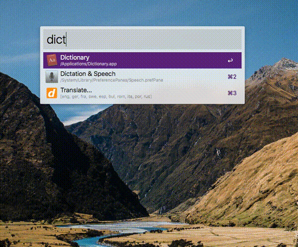
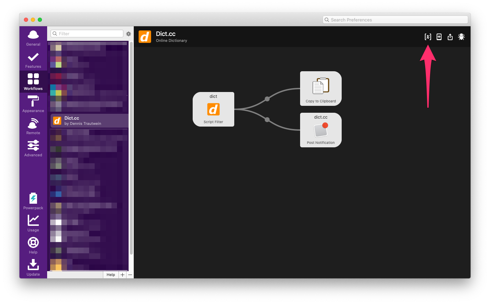
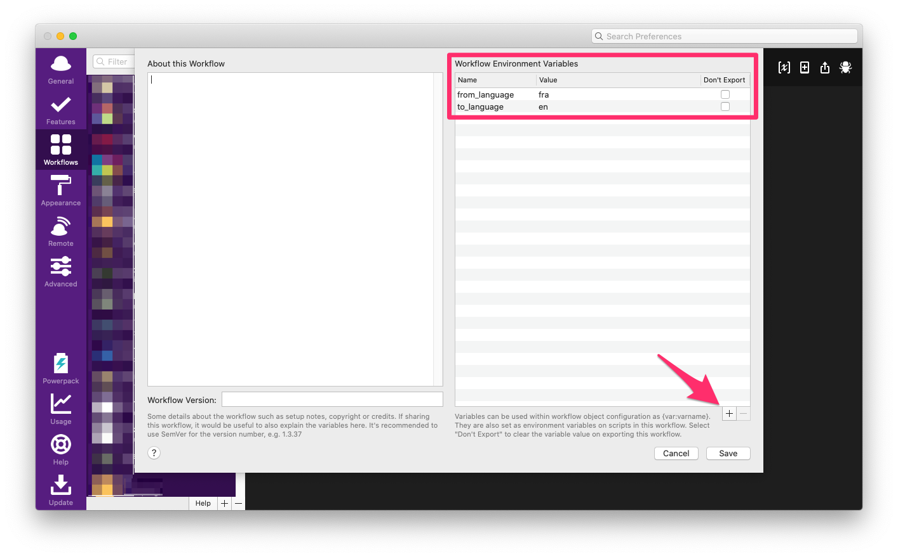

# Alfred dict.cc workflow

[Alfred](https://www.alfredapp.com/) workflow to get **bidirectional** translations from [dict.cc](http//dict.cc).

If you like the workflow give this repo a star ⭐ 

And if it saves you time you may consider to

## Download

Click [here](https://github.com/dennis-tra/alfred-dict.cc-workflow/releases/tag/1.1.0) and download `Dict.cc.alfredworkflow`

## Supported Languages

English, German, French, Swedish, Spanish, Bulgarian, Romanian, Italian, Portuguese, Russian

## Command

`dict lang1 lang2 word_to_translate`

You can omit `lang1` and `lang2` to just translate between german and english (both directions!). [See below](#default-language-pair) to customise the default language pair.

Possible values for `lang1` and `lang2`:

| Abbreviation | Language   |
| ------------ | ---------- |
| en, eng      | english    |
| de, ger      | german     |
| fr, fra      | french     |
| sv, swe      | swedish    |
| es, esp      | spanish    |
| bg, bul      | bulgarian  |
| ro, rom      | romanian   |
| it, ita      | italian    |
| pt, por      | portuguese |
| ru, rus      | russian    |

## Default Language Pair

You may not want the translations to be between english and german by default. To change this behaviour open the Alfred preferences, go to `Workflows`, select `Dict.cc` and click on the `Configure workflow and variables` button in the top right corner.

You should find the following two workflow environment variables:

1. `from_language`
2. `to_language`

Assign both variables one of the above abbreviations (either the two letter or three letter form). In the screenshot above the configuration says

* `from_language` - `fra`
* `to_language` - `en`

to translate between french and english by default.

**Note:** Although the variables are named `from_` and `to_` the translations will be bidirectional, so the order shouldn't really matter.

## Acknowledgement

The dict.cc website parser is based on [rbarons](https://github.com/rbaron/dict.cc.py) work. Thanks for that!
