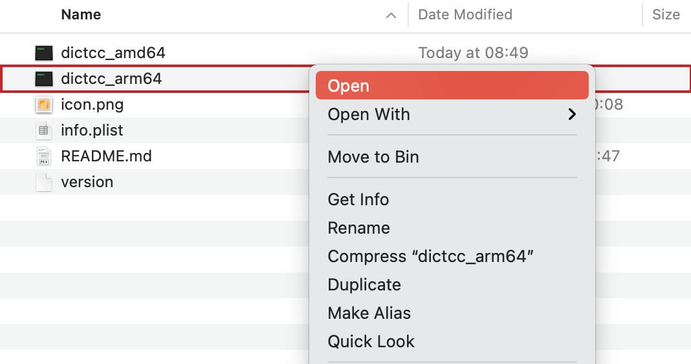

# Alfred dict.cc workflow

[](https://github.com/dennis-tra/alfred-dict.cc-workflow/releases)
[](https://codeclimate.com/github/dennis-tra/alfred-dict.cc-workflow/maintainability)

[Alfred](https://www.alfredapp.com/) workflow to get **bidirectional** translations from [dict.cc](http//dict.cc).

If you like the workflow give this repo a star ⭐


And if it saves you time you may consider to

<a href="https://www.buymeacoffee.com/dennistra" target="__blank"></a>

## Table of Contents

- [Table of Contents](#table-of-contents)
- [Download](#download)
- [Installation](#installation)
  - [Permissions](#permissions)
  - [Why do I need to do that?](#why-do-i-need-to-do-that)
- [Supported Languages](#supported-languages)
- [Command](#command)
- [Default Language Pair](#default-language-pair)
- [Development](#development)
- [Maintainers](#maintainers)
- [Contributing](#contributing)
- [Support](#support)
- [Other Projects](#other-projects)
- [License](#license)

## Download

Click [here](https://github.com/dennis-tra/alfred-dict.cc-workflow/releases/tag/v2.1.1) and download `Dict.cc.alfredworkflow`.

## Installation

Just double click the `Dict.cc.alfredworkflow` file and Alfred should pick it up automatically.

### Permissions

Since [Catalina](https://developer.apple.com/news/?id=10032019a), you need to tell MacOS that it's okay to run the included binaries. For that, you have the following two options:

<details>
<summary>Give execute permissions to the included binaries</summary>

Open the workflow directory


Right click on the `dictcc_*` binary for your platform (Intel Macs `dictcc_amd64`, M1 Macs `dictcc_arm64`) and select `Open` in the pop up.



This will open a Terminal window and you should see an error message. However, you have now indicated to MacOS that it's okay to run the binary.

Close all windows and you're good to go.

</details>

<details>
<summary>Give execute permissions to Alfred in general</summary>

Beware that the following configuration applies to all workflows you have currently installed and all future ones.


</details>

### Why do I need to do that?

Since [MacOS Catalina](https://developer.apple.com/news/?id=10032019a) Apple does not allow running arbitrary binaries unless they are notarized. Developers can notarize their binaries if they enroll for the Apple Developer Program which is around $100 per year. Since I am not enrolled, I can't notarize the binaries, and we need to live with the above inconvenience :/

## Supported Languages

English, German, French, Swedish, Spanish, Bulgarian, Romanian, Italian, Portuguese, Russian

## Command

`dict lang1 lang2 word_to_translate`

You can omit `lang1` and `lang2` to just translate between german and english (both directions!). [See below](#default-language-pair) to customise the default language pair.

Possible values for `lang1` and `lang2`:

| Abbreviation | Language   |
| ------------ | ---------- |
| en, eng      | english    |
| de, ger      | german     |
| fr, fra      | french     |
| sv, swe      | swedish    |
| es, esp      | spanish    |
| bg, bul      | bulgarian  |
| ro, rom      | romanian   |
| it, ita      | italian    |
| pt, por      | portuguese |
| ru, rus      | russian    |

## Default Language Pair

You may not want the translations to be between english and german by default. To change this behaviour open the Alfred preferences, go to `Workflows`, select `Dict.cc` and click on the `Configure workflow and variables` button in the top right corner.


You should find the following two workflow environment variables:

1. `from_language`
2. `to_language`


Assign both variables one of the above abbreviations (either the two letter or three letter form). In the screenshot above the configuration says

- `from_language` - `fra`
- `to_language` - `en`

to translate between french and english by default.

**Note:** Although the variables are named `from_` and `to_` the translations will be bidirectional, so the order shouldn't really matter.

## Development

Build the workflow:

```shell
GOOS=darwin GOARCH=arm64 go build -o dictcc_arm64 main.go
GOOS=darwin GOARCH=amd64 go build -o dictcc_amd64 main.go
```

Move both binaries to the workflow folder. For development I'd recommend symlinking them.

## Maintainers

[@dennis-tra](https://github.com/dennis-tra).

## Contributing

Feel free to dive in! [Open an issue](https://github.com/dennis-tra/pcp/issues/new) or submit PRs.

## Support

It would really make my day if you supported this project through [Buy Me A Coffee](https://www.buymeacoffee.com/dennistra).

## Other Projects

You may be interested in one of my other projects:

* [`nebula`](https://github.com/dennis-tra/nebula-crawler) - A libp2p DHT crawler that also monitors the liveness and availability of peers. 🏆 Winner of the [DI2F Workshop Hackathon](https://research.protocol.ai/blog/2021/decentralising-the-internet-with-ipfs-and-filecoin-di2f-a-report-from-the-trenches) 🏆
* [`pcp`](https://github.com/dennis-tra/pcp) - Command line peer-to-peer data transfer tool based on [libp2p](https://github.com/libp2p/go-libp2p).
* [`image-stego`](https://github.com/dennis-tra/image-stego) - A novel way to image manipulation detection. Steganography-based image integrity - Merkle tree nodes embedded into image chunks so that each chunk's integrity can be verified on its own.


## License

[Apache License Version 2.0](LICENSE) © Dennis Trautwein
